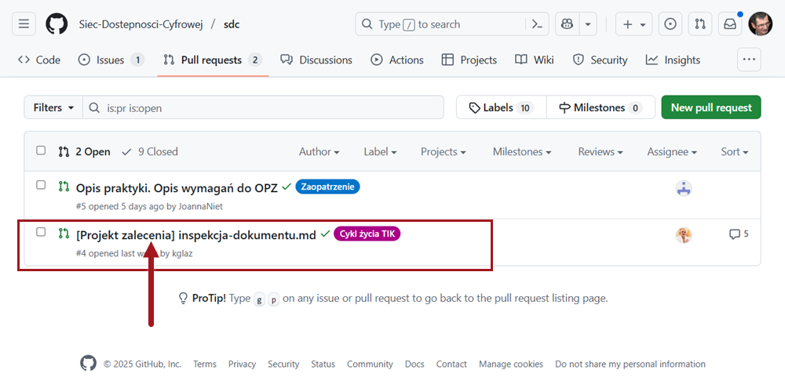

# Komentuj i sugeruj poprawki

## Proces oceny zgłoszonych projektów 
Zgłoszone przez uczestniczki i uczestników Sieci propozycje zaleceń i rozwiązań oraz opisy praktyk do katalogu dobrych praktyk podlegają ocenie całej Sieci, która ma prawo zdecydować, które ze zgłoszonych propozycji i w jakim ostatecznie kształcie znajdą się w dokumencie końcowym Sieci.

Proces uzyskiwania akceptacji złożony jest z kilku etapów:

1. **Ocena członków zespołu roboczego**. Najpierw zgłoszone propozycje poddawane są ocenie tego zespołu
   roboczego, w którym uczestniczy osoba zgłaszająca albo zespołu, który zajmuje się wymiarem dostępności, którego dotyczy zgłoszenie. 
   Członkowie zespołu i inni uczestnicy Sieci zapoznają się ze zgłoszoną propozycją, analizują ją i komentują. W komentarzach przedstawiają swoje wątpliwości, wskazują na walory i braki propozycji, sugerują uzupełnienia i poprawki.
2. **Ocena zespołu roboczego**. Autor zgłoszonej propozycji na podstawie dyskusji, w której również
   uczestniczy, ustala treść projektu, którą przedstawia do dyskusji podczas spotkania zespołu, a zespół decyduje na spotkaniu, czy chce skierować zgłoszoną propozycję pod rozwagę całej Sieci. Jeśli zespół uzna, że nie będzie rekomendować zgłoszonej propozycji, autor może zdecydować, że przedstawi ją pod rozwagę całej Sieci bez rekomendacji Zespołu.
3. **Pierwsza dyskusja podczas spotkania Sieci**. Przygotowane i przedyskutowane w zespołach propozycje  
   są publikowane na stronie Sieci (scalane z główną gałęzią repozytorium) i przedstawiane do dyskusji podczas spotkania całej Sieci. Dyskusja rozpoczyna etap <q>dojrzewania projektu</q>. W tym czasie wszyscy uczestnicy Sieci mogą zgłaszać swoje komentarze i propozycje poprawek. Prezydium Sieci wyznacza dodatkowo dwóch recenzentów projektu:
   - recenzenta ze swojego grona lub grona ekspertów Sieci oraz 
   - lidera zespołu roboczego lub - w porozumieniu z liderem zespołu roboczego - inną osobę z zespołu roboczego.
    Etap <q>dojrzewania projektu</q> trwa co najmniej jeden miesiąc. Uzgodnione poprawki są scalane z główną gałęzią repozytorium Sieci. 
4. **Ocena całej Sieci**. Nad <q>dojrzałym projektem</q> dyskusję (drugie czytanie) przeprowadza się na spotkaniu Sieci. Uczestnicy Sieci wysłuchują wystąpienia autora oraz co najmniej jednego koreferenta i podejmują decyzję o włączeniu projektu do dokumentu końcowego lub odrzuceniu.

## Jak dodawać swoje komentarze i propozycje poprawek do zgłoszonych propozycji

### Sposób 1. Użyj funkcji Issues

To bardzo prosty sposób. Zgłoś swój komentarz lub propozycje poprawek jako problem, używając funkcji Issues.  

#### Zgłoszenie nowego problemu
1. Przejdź do repozytorium projektu Sieci i wybierz kartę **Issues** (Problemy).
2. Wybierz przycisk **New Issue** (Nowy problem)
3. Wybierz szablon zgłoszenia
4. Wpisz w formularzu tytuł zgłoszenia. 
5. Wpisz treść zgłoszenia. 
6. Wybierz przycisk **Create** (Problemy).

#### Komentarz do zgłoszonego problemu
1. Przejdź do repozytorium projektu Sieci i wybierz kartę **Issues** (Problemy).
2. Wybierz z listy problem, do którego chcesz zgłosić komentarz.
3. W formularzu **Add a Comment** (Dodaj komentarz) umieść swój komentarz. Możesz:
   - posłużyć się znacznikami [Markdown](../poradniki/poradnik-do-markdown)
   - odnieść się do wypowiedzi dowolnego przedmówcy lub przedmówców: wpisz nazwę użytkownika poprzedzając ją znakiem; @
   - zacytować fragment wypowiedzi poprzednika albo fragment dokumentu, do którego chcesz się odnieść: skopiuj fragment, który chcesz zacytować, umieść na początku wiersza znak &gt; i spację, po czym wklej fragment, który chcesz oznaczyć jako cytat
   - zilustrować swój komentarz grafiką,  np. zrzutem ekranu: 

Prostota tego sposobu jest i ogromnym walorem, ale ma też swoją cenę. Żeby odnosić się do konretnego dokumentu, trzeba go otworzyć w nowym oknie, by w jednym oknie czytać i ewentualnie kopiować fragmenty, do których chcemy się odnieść, a w drugim wklejać skopiowane fragmenty i wpisywac swoje uwagi. 

W efekcie autorom również trudniej jest korzystać z uwag i sugestii komentujących.

Dlatego zalecamy i zachęcamy **sposób 2**.

### Sposób 2. Edytuj dokument
To nieco trudniejsza, ale o wiele bardziej efektywna metoda. Umożliwia komentowanie i zgłaszanie poprawek bezpośrednio w projekcie dokumentu, a cała dyskusja jest widoczna i zapamiętywana w historii **pull requesta**.

1. Przejdź do repozytorium Sieci i wybierz kartę **Pull requests** (Żądania scalenia).
2. Wybierz z listy projekt, do którego chcesz się odnieść.   
   
3. Na stronie projektu wybierz łącze **Files changed** (Zmienione pliki)  
   
4. Wybierz w obszarze edytora fragment dokumentu, do którego chcesz się odnieść:
   - **użytkownik myszy**: 
     - zaznacz numer wiersza, w którym zaczyna się zaczyna się fragment, do którego chcesz się odnieść, 
     - naciśnij Shift, 
     - przesuń wskaźnik myszy do miejsca, które chcesz wybrać, 
     - naciśnij przycisk **plus**, aby wywołać interfejs komentarza,   
   
   - **użytkownik klawiatury**: 
     - przejdź do numeru wiersza, od którego zaczyna się fragment, do którego chcesz się odnieść,
     - przenieś się strzałką na tekst wiersza, 
     - naciśnij klawisz Shift i strzałką w dół wybierz wiersze, które chcesz skomentować, 
     - naciśnij Enter, aby wywołać interfejs komentarza:   
   
5. 

