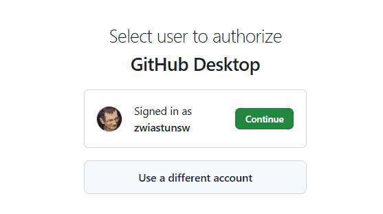
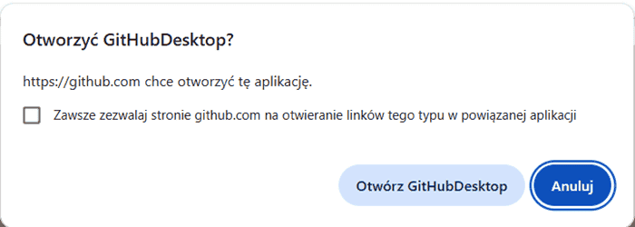
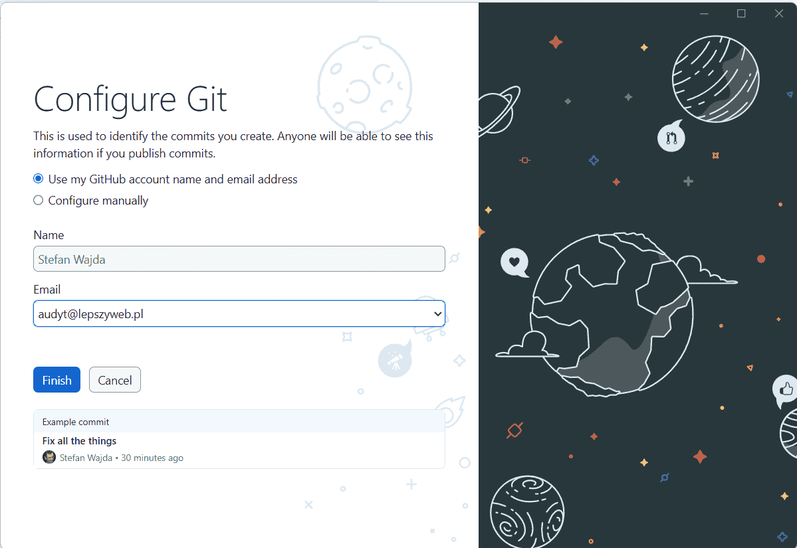
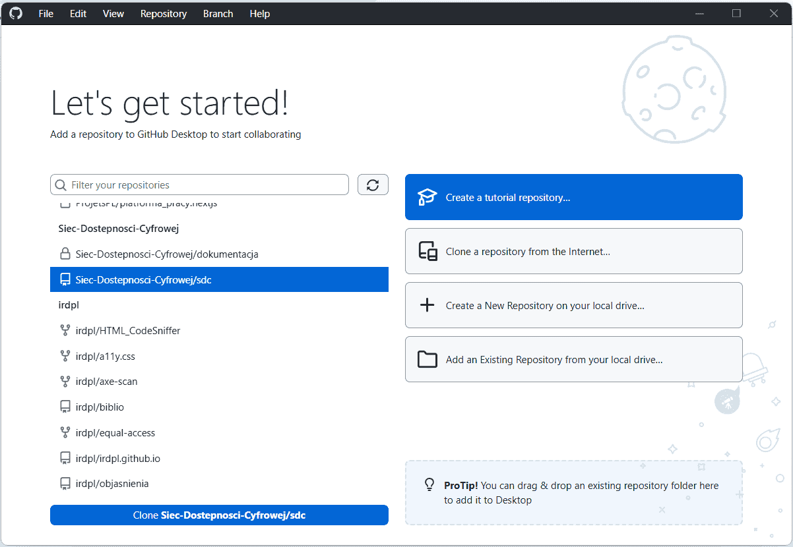

# Zainstaluj Github Destkop

Z Github możesz pracować bezpośrednio, tylko za pomocą przeglądarki internetowej.

Jeśli cenisz sobie wygodę i wydajność, zainstaluj **Github Destkop**. Bardzo upraszcza pracę.
Istnieją też alternatywne do Github Pages aplikacje, np. *Sourcetree* lib *GitKraken* 

1. [Przejdź na stronę destkop.github.com](https://destkop.github.com) i pobierz program odpowiedni dla swojego systemu operacyjnego, np. dla Windows
2. Uruchom plik instalacyjny i postępuj zgodnie z instrukcjami:  
     
3. Na ekranie powitalnym <em lang="en">Welcome to GitHub Destkop</em> wybierz przycisk **<em lang="en">Sign in to Github.com</em>** (Zarejestruj się na Github):  
     
4. Wskaż użytkownika, którego chcesz autoryzować i wybierz przycisk **<em lang="en">Continue</em>**. Jeśli masz więcej kont na GitHubie, wybierz konto powiązane z Siecią Dostępności Cyfrowej.  
     
5. Otwórz Github Destkop. Gdy strona github.com poprosi następnie o otwarcie Github Destkop, wyraź zgodę:  
     
6. Skonfiguruj Git. Twoje dane już będą wpisane, wystarczy więc, że wybierzesz przycisk **<em lang="en">Finish</em>**:  
     
7. Na ekranie *Let’s get started!* (Zaczynamy) wybierz repozytorium **Siec-Dostepnosci-Cyfrowej/sdc**. Nie pomyl się:   
     
8. Sklonuj repozytorium Sieci. W oknie <em lang="en">Clone a repository</em> wybierz przycisk **<em lang="en">Choose</em>** (Wybierz) i wskaż na swoim komputerze katalog, w którym chcesz przechowywać lokalną kopię repozytorium. Następnie wybierz przycisk **<em lang="en">Clone</em>** (Sklonuj):  
     
   
Prawie gotowe. Github Destkop jest skonfigurowany. Jeszcze tylko konfiguracja edytora.

[Skonfiguruj edytor kodu](skonfiguruj-edytor-kodu.md)  

