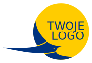

 
 
:::warning Uwaga

Jest to dokument roboczy, który w dowolnym momencie może zostać zaktualizowany, zastąpiony lub usunięty przez inne dokumenty. Nie należy traktować tego dokumentu jako czegoś innego niż dokument w trakcie opracowywania.

:::

1. **W-01. Zgodność. Dostawca opisze, w jaki sposób zapewni, że oferowane rozwiązanie będzie spełniać i utrzymywać zgodność z kryteriami sukcesu WCAG ujętymi w [__PL ETSI EN 301 549__](https://www.etsi.org/deliver/etsi_en/301500_301599/301549/01.01.02_60/en_301549v010102p.pdf) zgodnie z przepisami ustawy o dostępności cyfrowej... oraz wymaganiami wykraczającymi ponad ujęte w PN ETSI 301 549 (np. niektóre kryteria sukcesu na poziomie WCAG AAA, dobre praktyki).**  
Aby udowodnić, w jaki sposób oferowane rozwiązanie spełnia lub częściowo spełnia standardy WCAG dostawca może przedstawić:
    - raporty z testów, w tym zastosowane metody badania, wykaz użytych narzędzi testowych oraz przebieg procesu audytu lub procesu audytu podwykonawcy, którego zaangażował do testów zewnętrznych.
    - szczegółowy raport z audytu zgodności z WCAG, VPAT, ACR (raport zgodności produktu), dowody testów z użyciem technologii wspomagających lub testów z grupami użytkowników z niepełnosprawnościami. 
    
   **Gdy produkt jest częściowo zgodny**, dostawca przedstawi również swój plan naprawienia niezgodności oraz w jaki sposób planuje testować i utrzymywać zgodność w przyszłości.

2. **W-02. Dostosowanie. Dostawca opisze możliwości dostosowania przez nabywcę motywów, graficznego interfejsu użytkownika i funkcjonalności.**  
Dostawca określi, jaki wpływ na zgodność z wymogami dostępności mogą mieć dostosowania oraz w jaki sposób dostawca wspiera nabywcę w sprawdzaniu i łagodzeniu zagrożeń związanych z dostępnością dostosowań wprowadzanych podczas procesu wdrażania.  
Na przykład, czy dostawca przechowuje wytyczne dotyczące sposobu wdrażania zmian w graficznym interfejsie użytkownika lub motywie, aby zachować wymagania dotyczące kolorów lub powiększenia. Albo czy dostawca przechowuje listę użytych komponentów i ich znane problemy z dostępnością, aby nabywca mógł wybrać przed wdrożeniem tylko dostępne komponenty.
3. **W-03. Tworzenie treści. Dostawca opisze, w jaki sposób rozwiązanie wspiera tworzenie dostępnych treści cyfrowych i zapewnia ich zgodność z WCAG.**  
Na przykład, czy i jakie mechanizmy lub wskazówki zawiera rozwiązanie, aby pomóc twórcom treści w przesyłaniu lub pisaniu dostępnych treści internetowych, takie jak wbudowane testy struktury nagłówków, obecności tekstów alternatywnych, itp.
4. **W-04. Narzędzia dla pracowników. Dostawca opisze, w jaki sposób rozwiązanie wspiera pracowników z niepełnosprawnościami w korzystaniu z narzędzi do tworzenia treści, zgodnie z wytycznymi ATAG ([__Authoring Tools Accessibility Guidelines 2.0__](https://www.w3.org/TR/ATAG20/)).**  
Na przykład, w jaki sposób ekrany interfejsu redakcyjnego działają z elementami sterującymi klawiatury i technologiami wspomagającymi, takimi jak czytniki ekranu lub oprogramowanie do dyktowania, aby osobom z niepełnosprawnościami zapewnić możliwość nawigacji i interakcji z funkcjami oprogramowania.
5. **W-05. Nakładki. Dostawca wskaże, czy w dostarczanym rozwiązaniu korzysta lub planuje korzystać z jakichkolwiek produktów dostarczonych przez firmy wymienione w arkuszu [__Overlay Fact Sheet__](https://overlayfactsheet.com/#main) lub innych produktów tego typu.**  
Produkty (wtyczki, dodatki) Overlay i Underlay, które oferują naprawę problemów z dostępnością, reprezentują fałszywe podejście do zgodności z dostępnością i mogą stanowić ryzyko prawne oraz reputacyjne zarówno dla dostawcy, jak i nabywcy. Ponieważ produkty nakładkowe nie mogą być używane do zapewnienia zgodności z przepisami, ważne jest, aby jasno określić, gdzie i do czego dostawca używa takich produktów.
6. **W-06. Deklaracja. Dostawca dostarczy oświadczenie o dostępności swojego produktu, które przedstawia stan zgodności z normami dostępności, albo zobowiąże się współpracować z nabywcą w celu opracowania deklaracji dostępności dla proponowanego rozwiązania.**  
Warunkiem wstępnym (W-01) jest posiadanie przez dostawcę wystarczających dowodów testów zgodności z WCAG, na podstawie których można uzyskać szczegółowe informacje wymagane w deklaracji dostępności.  
7. **W-07. Wskazówki. Dostawca zapewni odpowiednie wskazówki użytkownikom technologii wspomagających albo zobowiąże się współpracować z nabywcą w celu przygotowania takich wystarczająco dokładnych wskazówek.**
8. **W-08. Dokumenty. Dostawca opisze, w jaki sposób zapewni, że wszelkie treści nieinternetowe generowane przez system będą spełniać wymogi dostępności.**  
Dotyczy to wszelkich innych treści niż internetowe, które generuje system, lub związanych z promocją, użytkowaniem albo zarządzaniem systemem, w tym wszystkich komunikatów, wiadomości e-mail, formatów wygenerowanych dokumentów, plików PDF, potwierdzeń działań użytkownika, dodatkowej korespondencji, próśb o dalsze informacje i użycia wtyczek innych firm.  
Zgodność zostanie oceniona na podstawie ujętych w [PL ETSI EN 301 549](https://www.etsi.org/deliver/etsi_en/301500_301599/301549/01.01.02_60/en_301549v010102p.pdf) kryteriów sukcesu WCAG odnoszących się do dokumentów nieinternetowych i znanych najlepszych praktyk projektowania dla dostępności.
